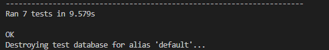

# Bull Street

### Use Case

A Swiss based family office has contracted me to build an investment analysis platform so them to analyse dividend paying stocks for their yield bearing investment portfolio, with a strong focus on European companies. There are tools out there that cover the companies they want to look at,but one of the biggest challenges they face is building a shortlist of companies they want to understand better in the first place.

To this end, the platform needs to focus on 3 areas:

1. A stock screener that allows the filtering on stock based on yield bearing criteria, namely yield size, payout ratio and price to earnings ratio
2. Individual stock pages where a breakdown of the companies fundamental performance can be tracked
3. An investment note taking feature. As users perform the necessary financial due diligence, it is important that they can take notes of their findings, and be able to edit and delete them. They must be easily accessible as they are often copied and shared in memos internally

The project is split into a react based frontend which can be found [here](https://www.sellyourtackle.co.uk/). This depository is dedicated to the backend, which has been built using Django's Rest Framework

## Features

The below feature list was submitted by the client:

* User auth api endpoints to allow users to sign up and log in via email
* Google auth integration to allow users to sign up and log in via Google
* Integration of EOD data API to import company data
* Various methods to remove companies which do not meet the clients investment criteria
* Company filter end points which allow users to filter companies in and out based on certain criteria
* Search endpoint to find companies int he database by search via name or ticker
* Note taking endpoint which will allow users to create, edit or delete investment research notes

### Site Owner and User Goals

As the site owner and user are the same, their gials are the same. There is no plan for them to license this software outside of their own company

* Discover stocks that fit their investment profile
* Help build a dividend paying stock portfolio for their family office, with a focus on European equities
* Keep track of investment ideas and thoughts on companies they have researched
* Include a wide range of key fundamental data for each company, where available. 

Frontend specific goals, such as logging in, SSO, filters and such are outlined in the frontend documentation found [here](https://www.sellyourtackle.co.uk/)

## Project Challenges

Investment decisions are only as good as the data they are based on. Because of this it was critical to choose a data provider who provides a robust financial data api solution that covered European equities. US copmany financial data is easy to find, and plenty of services already cover it, which is why the customer was not interested in including US data. 

The decision was made to use [End Of Day](https://eodhd.com/) fundamental data API. This API covers most of the end points required, and covered the major European exchanges. ALthough their datapoints were harmonised, there was a lot of work needed to manipulate the companies they covered so that only clean versions of each listing remained. 

Because of this, various management commands had to be built to remove unnecessary stocks from the database once stocks had been imported over the API. Due to limitations in EOD's API, there is no way to filter out these companies before they have been imported.

### Challenge 1 - API Limitations

API resquests are limited to 100,000 calls a day, and fundamental data for each copmany consumes 10 credits, limiting the total number of companies we were allowed to import/update over the API to 10,000 per day. There are some 100,000 European tickers available, so scripts had to be developed to import companies on an exchange basis. The management command to complete this is called europe_import_stock_data_uk.py. To change the exchange you can clone the file and change this function: 

def import_tickers(api_token, exchange='LSE'):
    ticker_url = (
        f'https://eodhd.com/api/exchange-symbol-list/{exchange}?api_token='
        f'{api_token}&fmt=json'
    )
    response = requests.get(ticker_url)

By swapping 'LSE' to a different exchange. A list of exhcnages can be found [here](https://eodhd.com/list-of-stock-markets):

### Challenge 2 - Removing Non-common Stocks

Companies are often listed on multiple exchanges, e.g. you can purchase Apple in most countries stock exchanges across the world, not just the Nasdaq. These are known as non-primary listings. Since the customer only wants primary listings, as this is where the fundamental data is to be stored, a range of clean up commands had to be built. 

The first one is the management command delete_non_common_stocks.py, this removes any stocks from the database where the stock type is not common

### Challenge 3 - Removing Non Primary Ticker Stocks

The second management command to help remove unwanted stocks is the delete_non_primary_ticker_stocks.py command, which removes any company whose uid != primary_ticker and primary_ticker is not blank

### Challenge 4 - Removing Stock Duplicates Where One Listing Has an Empty Sector

As EOD do not provide a way of defining what a primary listing is, further cleansing had to be built. An additional command delete_duplicate_stocks_empty_sector.py, finds duplicate stocks based on their tickers, and if one has an empty sector, this then deletes that version of it as it unlikely to be the primary listing

### Challenge 5 - Remove Non-Yield Paying Stocks

Since the customer is not interested in companies that do not pay a dividend, a final management command was built to remove any stocks what did not pay a dividend

This is not an exact science and some companies that should not make it into the database will fall through the cracks, but the client was happy with the approach and can accept a 5% degree of error

## Missing Data Points

Although very inclusive, the EOD API did not have all the fundamental datapoints required to meet their requirements. Because of this, additional management command files had to be built to process existing data in the database to meet these gaps

### 1. Historical Stock Prices

To work out the compounded annual growth rates (or CAGR, a term often used in financial planning), a command had to be built which imported the stock price 5 years ago and the price at the end of the last full year. To complicate matters, companies also sometimes perform stock splits, i.e. a 10:1 stock split would mean that the stock price goes from $100 to $10, so it might look like a oxmpanies share price had declined unless stock splits were taken into account. This command had to also take into accunt any stock splits and adjust the stock prices accordingly to give an accurate result

### 2. Dividend CAGR

Similarly to stock price CAGR, yield CAGR over 5 years is also an important metric when analysing the financial health of a company, the dividend_yield command does just that

### 3. Income Sheet CAGR

This management command works out the 5 year CAGR for important income statement metrics like revenue and net income

### 4. Stock Prices

Company fundamental data does not change on a daily basis, but stock prices do. The fundamental data api has a strict daily limit of 10k companies, however the stock prices API allows a whole exchanges stock prices to be downloaded for just 1,000 requests. The stock_prices command imports all sotck prices across all exchanges, and can be setup to run as a cronjob daily

## Design Process

The design process was based on user stories derived from the frontend build, these can be found [here](hesererer):

## User Stories

For the API side of the project I created a separate set of user stories, written from the perspective of a developer consuming the API. The API User Stories can be found here: Sonic Explorers API User Stories

# Structure

## Code Structure

The application is built using the Django Rest framework, and is broken up into 3 main apps to help with future maintaince, code transparency and further feature building

stockdata app - this houses all the stock related data such as importing and filtering out the stocks, as well as providing the backend api endpoints
usermanagement app - this houses all the authentication functionality, including login, logout, registration, password reset and allauth for SSO
config app - the houses the main app setting and master URL file

Within these apps you will find a models.py file, which contains all the models used in the app,a views.py file which contains all the views used in the app, and a urls.py file which contains all the URLs used in the app. Where necessary there is also a serializers.py file which converts the as Django model instances into api endpoints

Within the tackle and auth_app you will also find the relevant templates for each related page.

Within the apps you will find::

media/logo folder - this holds the company logos
stockdata/management/commands folder - this is where the management commands are hosted
Procfile - hosts the gunicorn setting for Heroku
manage.py - manages the database and the app
requirements.txt - list of thrid party libraries required to be installed when deployed

## Environment Variables

Enviroment variables are stored in a.env file, which is not tracked by git. This file contains all the sensitive information for the app, such as the database credentials. Once the app is deployed, the.env file is not tracked, and this sensitive information is stored in the Heroku environment variables.

## Database

The database used is a postgresql db hosted at neon.tech.

# Models Documentation

The following models were created to represent the database structure for the Stock Management and User system within the application:

## General Model

Represents the general information of a stock.

- **Fields**:
  - `code`: Stores the stock's code.
  - `type`: Stores the type of the stock.
  - `name`: Stores the stock's name.
  - `exchange`: Stores the exchange where the stock is listed.
  - `currency_code`: Stores the currency code.
  - `currency_name`: Stores the name of the currency.
  - `currency_symbol`: Stores the symbol of the currency.
  - `country_name`: Stores the name of the country.
  - `country_iso`: Stores the ISO code of the country.
  - `isin`: Stores the ISIN of the stock.
  - `uid`: Stores a unique identifier for the stock.
  - `primary_ticker`: Stores the primary ticker of the stock.
  - `fiscal_year_end`: Stores the fiscal year end date.
  - `sector`: Stores the sector of the stock.
  - `industry`: Stores the industry of the stock.
  - `address`: Stores the address of the stock's company.
  - `phone`: Stores the phone number of the stock's company.
  - `web_url`: Stores the URL of the stock's company's website.
  - `full_time_employees`: Stores the number of full-time employees.
  - `logo`: Stores the logo image of the stock's company.
  - `updated_at`: Records when the stock information was last updated.
- **Relationships**:
  - `followers`: Links to the User model, representing users who follow this stock.

## Description Model

Represents a detailed description of a stock.

- **Fields**:
  - `text`: Stores the description text.
- **Relationships**:
  - `general`: Links to the General model.

## Highlights Model

Represents the financial highlights of a stock.

- **Fields**:
  - `market_capitalization`: Stores the market capitalization.
  - `ebitda`: Stores the EBITDA.
  - `pe_ratio`: Stores the PE ratio.
  - `peg_ratio`: Stores the PEG ratio.
  - `wall_street_target_price`: Stores the Wall Street target price.
  - `book_value`: Stores the book value.
  - `dividend_share`: Stores the dividend per share.
  - `dividend_yield`: Stores the dividend yield.
  - `earnings_share`: Stores the earnings per share.
  - `eps_estimate_current_year`: Stores the EPS estimate for the current year.
  - `eps_estimate_next_year`: Stores the EPS estimate for the next year.
  - `eps_estimate_next_quarter`: Stores the EPS estimate for the next quarter.
  - `eps_estimate_current_quarter`: Stores the EPS estimate for the current quarter.
  - `most_recent_quarter`: Stores the date of the most recent quarter.
  - `profit_margin`: Stores the profit margin.
  - `operating_margin_ttm`: Stores the operating margin TTM.
  - `return_on_assets_ttm`: Stores the return on assets TTM.
  - `return_on_equity_ttm`: Stores the return on equity TTM.
  - `revenue_ttm`: Stores the revenue TTM.
  - `revenue_per_share_ttm`: Stores the revenue per share TTM.
  - `quarterly_revenue_growth_yoy`: Stores the quarterly revenue growth YoY.
  - `gross_profit_ttm`: Stores the gross profit TTM.
  - `diluted_eps_ttm`: Stores the diluted EPS TTM.
  - `quarterly_earnings_growth_yoy`: Stores the quarterly earnings growth YoY.
- **Relationships**:
  - `general`: Links to the General model.

## Valuation Model

Represents the valuation metrics of a stock.

- **Fields**:
  - `trailing_pe`: Stores the trailing PE ratio.
  - `forward_pe`: Stores the forward PE ratio.
  - `price_sales_ttm`: Stores the price to sales TTM ratio.
  - `price_book_mrq`: Stores the price to book MRQ ratio.
  - `enterprise_value`: Stores the enterprise value.
  - `enterprise_value_revenue`: Stores the enterprise value to revenue ratio.
  - `enterprise_value_ebitda`: Stores the enterprise value to EBITDA ratio.
- **Relationships**:
  - `general`: Links to the General model.

## Technicals Model

Represents the technical indicators of a stock.

- **Fields**:
  - `beta`: Stores the beta value.
  - `fifty_two_week_high`: Stores the 52-week high price.
  - `fifty_two_week_low`: Stores the 52-week low price.
  - `fifty_day_ma`: Stores the 50-day moving average.
  - `two_hundred_day_ma`: Stores the 200-day moving average.
  - `shares_short`: Stores the number of shares short.
  - `shares_short_prior_month`: Stores the number of shares short in the prior month.
  - `short_ratio`: Stores the short ratio.
  - `short_percent`: Stores the short percentage.
- **Relationships**:
  - `general`: Links to the General model.

## SplitsDividends Model

Represents the splits and dividends information of a stock.

- **Fields**:
  - `forward_annual_dividend_rate`: Stores the forward annual dividend rate.
  - `forward_annual_dividend_yield`: Stores the forward annual dividend yield.
  - `payout_ratio`: Stores the payout ratio.
  - `dividend_date`: Stores the dividend date.
  - `ex_dividend_date`: Stores the ex-dividend date.
  - `last_split_factor`: Stores the last split factor.
  - `last_split_date`: Stores the last split date.
- **Relationships**:
  - `general`: Links to the General model.

## AnalystRatings Model

Represents analyst ratings for a stock.

- **Fields**:
  - `rating`: Stores the analyst rating.
  - `target_price`: Stores the target price.
  - `strong_buy`: Stores the number of strong buy recommendations.
  - `buy`: Stores the number of buy recommendations.
  - `hold`: Stores the number of hold recommendations.
  - `sell`: Stores the number of sell recommendations.
  - `strong_sell`: Stores the number of strong sell recommendations.
- **Relationships**:
  - `general`: Links to the General model.

## BalanceSheet Model

Represents the balance sheet of a stock.

- **Fields**:
  - `date`: Stores the date of the balance sheet.
  - `common_stock_shares_outstanding`: Stores the common stock shares outstanding.
  - `type`: Specifies the type of balance sheet (Yearly, Quarterly).
- **Relationships**:
  - `general`: Links to the General model.

## CashFlow Model

Represents the cash flow statement of a stock.

- **Fields**:
  - `date`: Stores the date of the cash flow statement.
  - `dividends_paid`: Stores the dividends paid.
  - `type`: Specifies the type of cash flow statement (Yearly, Quarterly).
- **Relationships**:
  - `general`: Links to the General model.

## IncomeStatement Model

Represents the income statement of a stock.

- **Fields**:
  - `date`: Stores the date of the income statement.
  - `total_revenue`: Stores the total revenue.
  - `gross_profit`: Stores the gross profit.
  - `net_income`: Stores the net income.
  - `type`: Specifies the type of income statement (Yearly, Quarterly).
- **Relationships**:
  - `general`: Links to the General model.

## CAGR Model

Represents the Compound Annual Growth Rate (CAGR) of a stock.

- **Fields**:
  - `total_revenue_cagr`: Stores the total revenue CAGR.
  - `gross_profit_cagr`: Stores the gross profit CAGR.
  - `net_income_cagr`: Stores the net income CAGR.
- **Relationships**:
  - `general`: Links to the General model.

## Note Model

Represents notes made by users on stocks.

- **Fields**:
  - `content`: Stores the content of the note.
  - `created_at`: Records when the note was created.
  - `updated_at`: Records when the note was last updated.
- **Relationships**:
  - `user`: Links to the User model.
  - `stock`: Links to the General model.

## StockPrices Model

Represents the stock prices over the years.

- **Fields**:
  - `Y1`: Stores the stock price for year 1.
  - `Y2`: Stores the stock price for year 2.
  - `Y3`: Stores the stock price for year 3.
  - `Y4`: Stores the stock price for year 4.
  - `Y5`: Stores the stock price for year 5.
  - `Y6`: Stores the stock price for year 6.
  - `cagr_5_years`: Stores the 5-year CAGR of the stock price.
- **Relationships**:
  - `general`: Links to the General model.
- **Meta**:
  - `verbose_name_plural`: "Stock Prices"

## DividendYieldData Model

Represents the dividend yield data over the years.

- **Fields**:
  - `yield_Y1`: Stores the dividend yield for year 1.
  - `yield_Y2`: Stores the dividend yield for year 2.
  - `yield_Y3`: Stores the dividend yield for year 3.
  - `yield_Y4`: Stores the dividend yield for year 4.
  - `yield_Y5`: Stores the dividend yield for year 5.
  - `cagr_5_years`: Stores the 5-year CAGR of the dividend yield.
- **Relationships**:
  - `general`: Links to the General model.
- **Meta**:
  - `verbose_name_plural`: "Dividend Yield Data"

## Prices Model

Represents the current and previous closing prices of a stock.

- **Fields**:
  - `close`: Stores the current closing price.
  - `prev_close`: Stores the previous closing price.
  - `change`: Stores the change in price.
  - `change_p`: Stores the percentage change in price.
- **Relationships**:
  - `general`: Links to the General model.
- **Meta**:
  - `verbose_name_plural`: "Stock Prices"

## CustomUser Model

Represents users within the application with custom fields and behavior.

- **Fields**:
  - `email`: Stores the user's email and is used as the unique identifier for login.
  - `email_verified`: Indicates whether the user's email has been verified.
  - `avatar_url`: Stores the URL of the user's avatar image.
- **Methods**:
  - `__str__()`: Returns the user's email.
- **Manager**:
  - `CustomUserManager`: Handles user creation and management.

## CustomUserManager

Manages the creation and management of CustomUser instances.

- **Methods**:
  - `create_user(email, password, **extra_fields)`: Creates a new user with the given email and password.
  - `create_superuser(email, password, **extra_fields)`: Creates a new superuser with the given email and password.

These models are visually represented by the ERD below:

Note: The ERD modeling tool only allows up to 10 models to be displayed at a time.

# Serializers Documentation

The following serializers were created to represent the serialization structure for the Stock Management system within the application:

## IncomeStatementSerializer

Serializes the `IncomeStatement` model.

- **Meta**:
  - `model`: `IncomeStatement`
  - `fields`: `__all__`

## HighlightSerializer

Serializes the `Highlights` model.

- **Meta**:
  - `model`: `Highlights`
  - `fields`: `__all__`

## ValuationSerializer

Serializes the `Valuation` model.

- **Meta**:
  - `model`: `Valuation`
  - `fields`: `__all__`

## TechnicalsSerializer

Serializes the `Technicals` model.

- **Meta**:
  - `model`: `Technicals`
  - `fields`: `__all__`

## SplitsDividendsSerializer

Serializes the `SplitsDividends` model.

- **Meta**:
  - `model`: `SplitsDividends`
  - `fields`: `__all__`

## AnalystRatingsSerializer

Serializes the `AnalystRatings` model.

- **Meta**:
  - `model`: `AnalystRatings`
  - `fields`: `__all__`

## DescriptionSerializer

Serializes the `Description` model.

- **Meta**:
  - `model`: `Description`
  - `fields`: `__all__`

## CagrSerializer

Serializes the `CAGR` model.

- **Meta**:
  - `model`: `CAGR`
  - `fields`: `__all__`

## BalanceSheetSerializer

Serializes the `BalanceSheet` model.

- **Meta**:
  - `model`: `BalanceSheet`
  - `fields`: `__all__`

## CashFlowSerializer

Serializes the `CashFlow` model.

- **Meta**:
  - `model`: `CashFlow`
  - `fields`: `__all__`

## StockPricesSerializer

Serializes the `StockPrices` model.

- **Meta**:
  - `model`: `StockPrices`
  - `fields`: `__all__`

## PricesSerializer

Serializes the `Prices` model.

- **Meta**:
  - `model`: `Prices`
  - `fields`: `__all__`

## DividendYieldDataSerializer

Serializes the `DividendYieldData` model.

- **Meta**:
  - `model`: `DividendYieldData`
  - `fields`: `__all__`

## GeneralSerializer

Serializes the `General` model and includes nested serializers for related models.

- **Fields**:
  - `highlights`: Uses `HighlightSerializer` (read-only).
  - `valuation`: Uses `ValuationSerializer` (read-only).
  - `technicals`: Uses `TechnicalsSerializer` (read-only).
  - `splits_dividends`: Uses `SplitsDividendsSerializer` (read-only).
  - `analyst_ratings`: Uses `AnalystRatingsSerializer` (read-only).
  - `general_description`: Uses `DescriptionSerializer` (read-only).
  - `general_cagr`: Uses `CagrSerializer` (read-only).
  - `income_statements`: Uses `IncomeStatementSerializer` (many=True, read-only).
  - `balance_sheets`: Uses `BalanceSheetSerializer` (many=True, read-only).
  - `cash_flows`: Uses `CashFlowSerializer` (many=True, read-only).
  - `stock_prices`: Uses `StockPricesSerializer` (many=True, read-only).
  - `dividend_yield_data`: Uses `DividendYieldDataSerializer` (read-only).
  - `prices`: Uses `PricesSerializer` (read-only).
- **Meta**:
  - `model`: `General`
  - `fields`: `__all__`

## NoteSerializer

Serializes the `Note` model.

- **Fields**:
  - `user`: Uses `PrimaryKeyRelatedField` (read-only).
- **Meta**:
  - `model`: `Note`
  - `fields`: `['id', 'user', 'stock', 'content', 'created_at', 'updated_at']`

## StockSearchSerializer

Serializes a subset of the `General` model fields for search functionality.

- **Meta**:
  - `model`: `General`
  - `fields`: `('uid', 'code', 'name', 'primary_ticker', 'country_iso')`

## DividendSerializer

Serializes detailed dividend information, combining fields from multiple related models.

- **Fields**:
  - `uid`
  - `name`
  - `primary_ticker`
  - `country_iso`
  - `industry`
  - `exchange`
  - `currency_symbol`
  - `market_capitalization`: From `highlights`.
  - `pe_ratio`: From `highlights`.
  - `dividend_yield`: From `highlights`.
  - `forward_annual_dividend_yield`: From `splits_dividends`.
  - `payout_ratio`: From `splits_dividends`.
  - `dividend_date`: From `splits_dividends`.
  - `cagr_5_years`: From `dividend_yield_data`.
- **Meta**:
  - `model`: `General`

## API Documentation

The API documentation for this project is generated using Python's drf-yasg package, which provides interactive and easy-to-understand Swagger documentation for your Django REST Framework (DRF) APIs. Developers can use this documentation to explore and test the available API endpoints directly from the browser. The documentation includes detailed descriptions of each endpoint, including request and response formats, parameters, and authentication methods. To access the Swagger documentation, navigate to https://django-stocks-ecbc6bc5e208.herokuapp.com/swagger/ in your browser. For an alternative view, the ReDoc documentation is available at https://django-stocks-ecbc6bc5e208.herokuapp.com/redoc/. This comprehensive documentation aids in understanding the API's functionality

## API Endpoints

This backend application exposes various API endpoints to manage user authentication, stock data, and note-taking features. Below is a detailed list of available endpoints and their functionalities:

### Authentication Endpoints

#### User Registration
- **Endpoint:** `/register/`
- **Method:** `POST`
- **Description:** Creates a new user account.
- **Request Body:**
  - `email`: The user's email address.
  - `password`: The user's password.
- **Response:**
  - **201 Created:** User account successfully created.
  - **400 Bad Request:** Invalid input data.

#### User Login
- **Endpoint:** `/auth/login/`
- **Method:** `POST`
- **Description:** Authenticates a user and returns a token.
- **Request Body:**
  - `email`: The user's email address.
  - `password`: The user's password.
- **Response:**
  - **200 OK:** Authentication successful.
  - **400 Bad Request:** Invalid credentials.

#### Google Sign-In
- **Endpoint:** `/google/login/`
- **Method:** `POST`
- **Description:** Authenticates a user via Google OAuth and returns a token.
- **Request Body:**
  - `token`: Google OAuth token.
- **Response:**
  - **200 OK:** Authentication successful.
  - **400 Bad Request:** Invalid token or email not verified.

### Password Management Endpoints

#### Password Reset Request
- **Endpoint:** `/custom-password-reset/`
- **Method:** `POST`
- **Description:** Sends a password reset email to the user.
- **Request Body:**
  - `email`: The user's email address.
- **Response:**
  - **200 OK:** Password reset email sent.
  - **400 Bad Request:** User with this email does not exist.

#### Password Reset Confirm
- **Endpoint:** `/custom/auth/password/reset/confirm/`
- **Method:** `POST`
- **Description:** Resets the user's password.
- **Request Body:**
  - `uid`: The user's ID.
  - `token`: The reset token.
  - `new_password1`: The new password.
  - `new_password2`: Confirmation of the new password.
- **Response:**
  - **200 OK:** Password has been reset successfully.
  - **400 Bad Request:** Invalid token.
  - **400 Bad Request:** Passwords do not match.
  - **400 Bad Request:** Invalid UID.

### Email Verification Endpoint

#### Verify Email
- **Endpoint:** `/verify-email/<uidb64>/<token>/`
- **Method:** `GET`
- **Description:** Verifies a user's email address.
- **Response:**
  - **200 OK:** Email verified successfully.
  - **400 Bad Request:** Verification link is invalid.
  - **400 Bad Request:** Invalid request.

### Contact Endpoint

#### Send Contact Email
- **Endpoint:** `/send-email/`
- **Method:** `POST`
- **Description:** Sends a contact email.
- **Request Body:**
  - `name`: The name of the person sending the email.
  - `email`: The email address of the person sending the email.
  - `message`: The content of the email.
- **Response:**
  - **200 OK:** Email sent successfully.
  - **500 Internal Server Error:** Failed to send email.

### Stock Management Endpoints

#### Stock Detail
- **Endpoint:** `/stocks/<uid>/`
- **Method:** `GET`
- **Description:** Retrieve details of a stock.
- **Response:**
  - **200 OK:** Returns stock details.

#### Toggle Follow Stock
- **Endpoint:** `/stocks/<uid>/follow/`
- **Method:** `POST`
- **Description:** Toggle follow/unfollow a stock.
- **Response:**
  - **200 OK:** Successfully followed/unfollowed the stock.
  - **404 Not Found:** Stock not found.

### Note Management Endpoints

#### List and Create Notes
- **Endpoint:** `/notes/`
- **Method:** `GET`, `POST`
- **Description:** List all notes or create a new note.
- **Response:**
  - **200 OK:** Returns a list of notes.
  - **201 Created:** Note successfully created.

#### Note Detail
- **Endpoint:** `/notes/<id>/`
- **Method:** `GET`, `PUT`, `DELETE`
- **Description:** Retrieve, update, or delete a note.
- **Response:**
  - **200 OK:** Returns note details.
  - **200 OK:** Note successfully updated.
  - **204 No Content:** Note successfully deleted.

### Followed Stocks Endpoint

#### Followed Stocks
- **Endpoint:** `/followed-stocks/`
- **Method:** `GET`
- **Description:** List all stocks followed by the user.
- **Response:**
  - **200 OK:** Returns a list of followed stocks.

### Stock Search Endpoint

#### Search Stocks
- **Endpoint:** `/stocks/search/`
- **Method:** `GET`
- **Description:** Search stocks by code or name.
- **Response:**
  - **200 OK:** Returns search results.

### Dividend Data Endpoint

#### Dividend Data
- **Endpoint:** `/dividend-data/`
- **Method:** `GET`
- **Description:** List dividend data with filters.
- **Response:**
  - **200 OK:** Returns filtered dividend data.

## Technologies Used

### Languages and Frameworks

* Python
* Django
* Django REST Framework (DRF)

### Libraries and Tools

- **dj-rest-auth**: Authentication library for Django REST Framework.
- **Django**: High-level Python web framework.
- **django-allauth**: Integrated set of Django applications addressing authentication, registration, account management as well as 3rd party (social) account authentication.
- **django-cors-headers**: Django app for handling the server headers required for Cross-Origin Resource Sharing (CORS).
- **djangorestframework**: Powerful and flexible toolkit for building Web APIs.
- **djangorestframework-simplejwt**: JSON Web Token authentication for Django REST Framework.
- **drf-yasg**: Automated generation of real Swagger/OpenAPI 2.0 specifications from Django Rest Framework code.
- **eodhd**: End of Day Historical Data API.
- **flake8**: A Python linting tool
- **fonttools**: Library to manipulate font files.
- **gitignore_parser**: Ignores files in the .gitignore file when testing for pep8 compliance
- **google-auth**: Google Authentication Library.
- **gunicorn**: Python WSGI HTTP Server for UNIX.
- **markdown-it-py**: Markdown parser for Python.
- **mdurl**: URL utilities for markdown-it.
- **numpy**: The fundamental package for array computing with Python.
- **oauthlib**: A generic, spec-compliant, thorough implementation of the OAuth request-signing logic.
- **pandas**: Powerful data structures for data analysis, time series, and statistics.
- **pillow**: Python Imaging Library (PIL).
- **psycopg2**: PostgreSQL adapter for Python.
- **requests-oauthlib**: OAuthlib integration for Requests.

## Validation

To comply with PEP8 standards all .py files where run through the Code Institutes PEP8 linter. Once all files had passed, flake8, a Pep8 compliance tool built for Python was installed and run to generate a lint report file. The results and be found in the lint_reports folder as a txt file. The only error it found was:

stockdata\management\commands\delete_non_dividend_stocks.py:3:1: F401 'stockdata.models.Highlights' imported but unused

However this is a false negative and the highlights model is used in the function:

    def handle(self, *args, **kwargs):
        stocks_to_delete = General.objects.filter(
            Q(highlights__dividend_yield__isnull=True) |
            Q(highlights__dividend_yield=0.00)
        )

To run futher validation, the file "lint_and_capture.py" can be run by running the command python lint_and_capture.py, or by setting up a cronjob on the server. A new report will be generated every time this is run

## Testing

### Automated Unit Testing

* Testing using Django unittest
* The test file can be found in the `usermanagement` app
* To run, call `python manage.py test` in the terminal

#### View Tests
- **StockDataTests**
  - **test_stock_detail_view**
    - Tests the stock detail view for correct HTTP response and data retrieval.
  - **test_toggle_follow_stock**
    - Tests the toggle follow stock functionality for correct HTTP response.
  - **test_note_list_create_view**
    - Tests the note list and create view for correct HTTP response when listing notes.
    - Tests the note creation functionality for correct HTTP response and data creation.
  - **test_note_detail_view**
    - Tests the note detail view for correct HTTP response when retrieving a note.
    - Tests updating a note for correct HTTP response and data update.
    - Tests deleting a note for correct HTTP response and data deletion.
  - **test_followed_stocks_view**
    - Tests the followed stocks view for correct HTTP response and data retrieval.
  - **test_stock_search_view**
    - Tests the stock search view for correct HTTP response and search functionality.
  - **test_dividend_data_list_view**
    - Tests the dividend data list view for correct HTTP response and data retrieval.

Unit Test Results

All tests pass with "OK" status.

## Security

The following security measures are in place:

- **Environment Variables**: All sensitive information, such as passwords and security keys, are stored as environment variables. This helps keep secrets out of the codebase.
- **Password Hashing**: User passwords are stored as hashed values in the database using Django's built-in password hashing mechanisms. This prevents password leaks in case of a database breach.
- **User Authentication**: Access to certain endpoints and pages is restricted to authenticated users, ensuring that only authorized users can perform certain actions.
- **Role-Based Access Control**: Different sections of the application are accessible based on user roles, ensuring that users can only access features and data pertinent to their permissions.
- **Django Admin Protection**: The Django admin interface is accessible only to superusers, adding an additional layer of security to administrative functions.
- **HTTPS**: All data transmitted between clients and the server is encrypted using HTTPS, protecting data in transit from eavesdropping and man-in-the-middle attacks.
- **Security Headers**: HTTP security headers such as Content Security Policy (CSP), X-Content-Type-Options, and X-Frame-Options are used to protect against common web vulnerabilities.
- **Regular Security Audits**: Regular security audits and code reviews are conducted to identify and mitigate potential security risks.

## Bug Fixes

| **Bug** | **Fix** |
| ------- | ------- |
| Password reset token was not invalidating after use | Updated the password reset process to correctly mark tokens as used after a successful password reset |
| API endpoints not returning detailed error messages | Enhanced error handling to provide more informative error messages from API endpoints |
| Missing CSRF token error during user registration | Ensured that CSRF tokens are correctly included in user registration forms and API requests |
| Incorrect stock data import due to API rate limits | Implemented rate limiting and retry logic to handle API rate limits during stock data import |
| User follow/unfollow action was not updating the UI | Added real-time updates to the UI when users follow or unfollow stocks |
| Notes not saving user information correctly | Fixed the note creation process to correctly associate notes with the authenticated user |
| Pagination issues in the dividend data list view | Corrected pagination logic to properly paginate dividend data results |
| Logo image URL was not being stored correctly for stocks | Modified the stock update function to correctly handle and store logo URLs |
| User email verification link not working | Updated the email verification process to correctly handle and validate verification tokens |
| Google sign-in failing for some users | Fixed the Google sign-in process to handle various edge cases and errors during authentication |
| Stock search functionality not filtering results properly | Improved the stock search algorithm to accurately filter results based on user queries |
| Highlight data not displaying correctly on stock detail view | Corrected the data serialization to ensure highlight data is displayed correctly on the stock detail page |

## Database Indexing

The column for the stock `uid` and `name` have been indexed to improve search result speeds.

## Heroku Deployment

For the official Heroku deployment documentation, please visit [here](https://devcenter.heroku.com/articles/git).

### Step One

Make sure your GitHub repo for the build is up to date. You will be automatically deploying the latest code from your GitHub repo. Items to confirm:

- Your `requirements.txt` file contains all the dependencies needed for the project. Run `pip freeze > requirements.txt` in the terminal if unsure.
- You have migrated all changes to the database before deploying. Run `python manage.py makemigrations` and `python manage.py migrate` in the terminal.
- Check all passwords and other sensitive information are stored in a `.env` file and are called throughout the build as environment variables, not hardcoded anywhere.
- You have a `Procfile` in the root of the project with the following content: `web: gunicorn djangostocks.wsgi`.
- You are connected to an external Postgres database and have the necessary environment variables set in the `settings.py` file for connecting to it. This build is using a Serverless Postgres DB hosted at www.neon.tech.
- Ensure debug is set to `FALSE` in the `settings.py` file.

### Step Two

Visit [Heroku](https://id.heroku.com/login) and log in. If you do not have an account, create one.

### Step Three

Create a new app, choose a name, and select the region closest to where the majority of your users are located.

### Step Four

Within the new app, go to the Settings tab and navigate to Config Vars. Add the necessary environment variables from the `.env` file here.

### Step Five

Next, go to the "Deploy" tab. Click on "Connect to GitHub" and select your repo. Click on "Enable Automatic Deploys" and then "Deploy Branch".

### Step Six

Monitor logs

The application will then attempt to build and deploy using the GitHub source code. You can monitor the logs by going to the "More" tab in the top right and clicking on "View logs". If it fails for any reason, you will be able to debug from there.

## Forking the GitHub Repository

1. Go to the GitHub repository https://github.com/ouzifeng/CI_PP5_API
2. Click on Fork button in the top right corner.
3. You will then have a copy of the repository in your own GitHub account.

## Making a Local Clone

1. Go to the GitHub repository.
2. Locate the Code button above the list of files and click it.
3. Highlight the "HTTPS" button to clone with HTTPS and copy the link.
4. Open Git Bash.
5. Change the current working directory to the one where you want the cloned directory.
6. Type `git clone` and paste the URL from the clipboard (`$ git clone https://github.com/ouzifeng/CI_PP5_API`).
7. Press Enter to create your local clone.

## Credits

### Images

Images used were sourced from www.exampleimages.com.

### Code

- Django REST Framework is used for building the API.
- Heroku is used for deployment.
- PostgreSQL is used as the database.
- Git and GitHub are used for version control.

## Acknowledgements

### Special thanks to the following:
- My Mentor Mo Shami